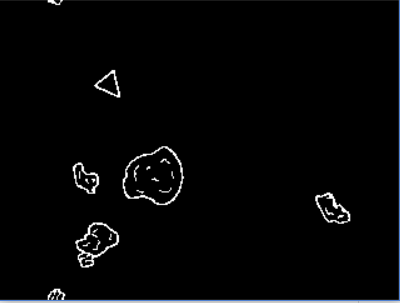
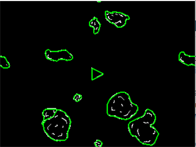

A common lisp asteroids implementation using CEPL.



Press g to get a geometry overlay.



# To play

Clone the repository to a [quicklisp accessible location](https://www.quicklisp.org/beta/).

```lisp
(ql:quickload :asteroids)
(in-package :asteroids)
(asteroids :start)
```


## Keys

- wsad to steer
- z to stop
- space fires, hold down for continuous fire
- g to toggle geometry overlay
